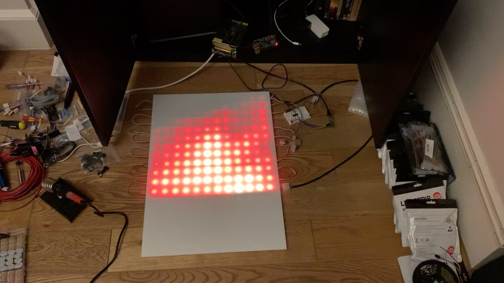

# Andrew's LED effects



This project creates a series of effects to be displayed using multiple different renderers:

* Browser-based simulator
* WS2812x directly connected to raspberry pi GPIO using [node-rpi-ws2812x-native](https://github.com/beyondscreen/node-rpi-ws281x-native)
* [Fadecandy server](https://www.adafruit.com/product/1689)

The rPi's native PWM driver does work, but I found the Fadecandy to be a wonderful product with great colour correction and dithering, and the advantage of allowing computers other than rPis to be used.  The system you run it on simply needs to have the FC connected over USB.

## Architecture

This project is written in TypeScript and organised around a number of distinct concepts:

* Shapes
* Layers
* Scenes
* Compositor
* Renderers
* Player

## Hardware setup

Component list

* Raspberry Pi 4
* 8GB Micro SD card
* Fadecandy
* USB A - Mini USB cable
* Right-angled 8x2 ribbon cable socket
* Ribbon cable
* WS2812B LED strip (30 LEDs/metre)
* 5V power supply
* WS2812 pre-soldered connectors

Tool list:

*

## Hardware setup

For the bamboo project:

### Prep the Rpi

1. Download [Raspbian lite](https://www.raspberrypi.org/downloads/raspbian/) (current version was Buster)
2. Use [balena Etcher](https://www.balena.io/etcher/) to flash it to an SD card
3. Create the `wpa_supplicant.conf` and `ssh` files in the boot partition as instructed by the [headless setup instructions](https://www.raspberrypi.org/documentation/configuration/wireless/headless.md) to allow the pi to connect to wifi when it boots
4. Eject and remove the SD card from the laptop and plug it into the Pi.
5. Connect a power supply and power-up the Pi.  Wait 1 minute.
6. Use [IP Scanner](https://apps.apple.com/us/app/ip-scanner-home/id422293948) to locate the Pi on the network
7. From a bash terminal on the laptop, connect to the Pi (password 'raspberry'):

```bash
> ssh pi@192.168.1.118
```

8. Update the OS (this takes ages)

```bash
> sudo apt update
> sudo apt full-upgrade
```

9. Install NodeJS and Git:

```bash
> curl -sSL https://deb.nodesource.com/setup_16.x | sudo bash -
> sudo apt install -y nodejs git
```

10. Clone this project.  Use HTTP github URL so there's no need to add SSH keys onto the pi.

```bash
> git clone https://github.com/triblondon/pixel-wall.git
> cd pixel-wall
> npm install
```

11. Clone fadecandy

```bash
> cd ~
> git clone https://github.com/scanlime/fadecandy.git
```

12. Create a fadecandy config file.  `"listen": [null, 7890]` is required to enable fc to listen for remote connections, and `map` is used to limit the initial set of LEDs to 6.

```
> cd ~/pixel-wall
> nano facecandy-config.json
```
```
{
  "listen": [null, 7890],
  "relay": null,
  "verbose": true,

  "color": {
		"gamma": 2.5,
		"whitepoint": [1.0, 1.0, 1.0]
  },

  "devices": [
		{
			"type": "fadecandy",
			"serial": "______________________",
			"map": [
					[ 0, 0, 0, 6 ]
			]
		}
  ]
}
```

### Test fadecandy

Run the server, and connect the Fadecandy board to the rpi using a USBA - Mini USB cable.  The terminal acknowledges the connection:

```
> sudo ~/fadecandy/bin/fcserver-rpi ~/pixel-wall/fadecandy-config.json
[1581767783:9703] NOTICE: Server listening on *:7890
USB device Fadecandy (Serial# XXXXXXXXXXXXXXXX, Version 1.07) attached.
```

Try opening a browser to http://[IPADDRESS]:7890/ to check that the server is accessible.

Connect an LED strip to the Fadecandy, using the rpi for power for now:

* LED +ve -> GPIO 4 (5v)
* LED data -> Fadecandy pin 0
* LED -ve -> GPIO 6 (ground)
* Fadecandy ground -> GPIO 14 (ground)

I soldered a right angle 16-pin IDC ribbon cable connector to the fadecandy connected a ribbon cable and used a multimeter to find the right pin on the end of the ribbon.

Run the Flame simulation:

```
> cd ~/pixel-wall
> npm start
```

Hopefully the LEDs light up and flicker

### Install LEDs

I cut the first six LEDs off the strip in three sets of two.  Each set was connected to the next with a snap-on 15cm connector wire.  Lesson: a single hole in the base of the bamboo is much easier to work with than threading the strip in one hole and out another.

### Configure processes to start on system boot

Create a `systemd` profile for the fadecandy server ([guide](https://timleland.com/how-to-run-a-linux-program-on-startup/)):

```
> sudo nano /etc/systemd/system/fadecandy.service
```

Paste:

```
Description=Fadecandy

Wants=network.target
After=syslog.target network-online.target

[Service]
Type=simple
ExecStart=/home/pi/fadecandy/bin/fcserver-rpi /home/pi/pixel-wall/config/fadecandy.json
Restart=on-failure
RestartSec=10
KillMode=process

[Install]
WantedBy=multi-user.target
```

```
> sudo nano /etc/systemd/system/led-player.service
```

Paste:

```
Description=LED player

Wants=network.target fadecandy.target
After=syslog.target network-online.target

[Service]
Type=simple
WorkingDirectory=/home/pi/pixel-wall
ExecStart=npm start
Restart=on-failure
RestartSec=10
KillMode=process

[Install]
WantedBy=multi-user.target
```

Run:

```
> sudo systemctl daemon-reload
> sudo systemctl enable fadecandy
> sudo systemctl enable led-player
> sudo systemctl start fadecandy
> sudo systemctl start led-player
```

### Mounting the LEDs

TODO: solder wires onto LED strips, heatshrink on the strips, glue gun the strips into the bamboo.

### Connecting groups

TODO: connect JST connector at the end of the first and last bamboo of the group.  Make longer wires connecting between groups.

### Improve power


## Troubleshooting:

### The Raspberry Pi 4 doesn't like electricity

It requires a very particular USBC power cable and won't work with my common-or-garden MacBook power supply.  Solved by ordering the [official power supply](https://thepihut.com/products/raspberry-pi-psu-uk).

### rpi-ws281x-native refuses to compile on the pi

I have this running on another rpi but no idea how I got it to compile as it now chokes on the npm install.  Fixed by removing the rpi-ws281x-native dependency, which isn't needed anyway now that I'm using fadecandy.
